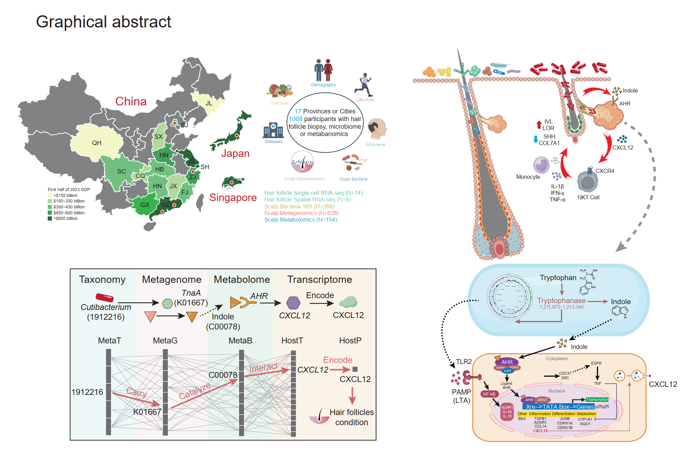

# Skin Microbiota Dysbiosis & Hair Follicle Regeneration

## 📝 Abstract
Across 1,068 participants in a 3-year, four-country study, scalp microbiome patterns track alopecia severity, progression, and treatment response. We built the Hair Microbiome Health Index (HMHI) to flag and predict disease course. A multi-omics Microbe–Metabolites–Host Crosstalk model shows Cutibacterium acnes converts tryptophan to indole, overactivating AHR in sebocytes, triggering CXCL12 release, recruiting CXCR4+ NKT cells, and stalling follicle growth. Targeting microbe–host signaling offers a therapeutic path for hair loss.

## 🎨 Graphical Abstract

## 🧰 Code
- `code/seurat_utils.R` + `code/cellchat_utils.R`: streamlined Seurat and CellChat workflows.
- `code/microbiome_utils.R` + `code/microbiome_prediction_utils.R`: microbiome stats, ordination, and prediction helpers.
- `code/enrichment_utils.R` + `code/kegg_utils.R` + `code/limma_utils.R`: differential testing and KEGG/GSEA enrichment.
- `code/metabolism_utils.R` + `code/heatmap_utils.R` + `code/plot_utils.R` + `code/theme_utils.R`: metabolite cleanup plus ready-made plots, heatmaps, and themes.
- `code/multiomics_utils.R` + `code/lefse_utils.R` + `code/iobr_utils.R` + `code/tempdir_utils.R`: multi-omics merging, LEfSe wrappers, signature scoring, and fixed temp directories.

## 📂 Data Availability
- Single-cell RNA-seq and spatial transcriptomics: GSA-Human HRAXXXX (noncommercial academic use; MTA required).
- Metagenome and 16S rRNA gene sequences: ENA PRJEB103845.

## 📖 Citation
Skin microbiota dysbiosis inhibit hair follicle regeneration; Under Review, 2025

## 📧 Lead Contact
Gaofeng Wang (gwang45@jhmi.edu)
